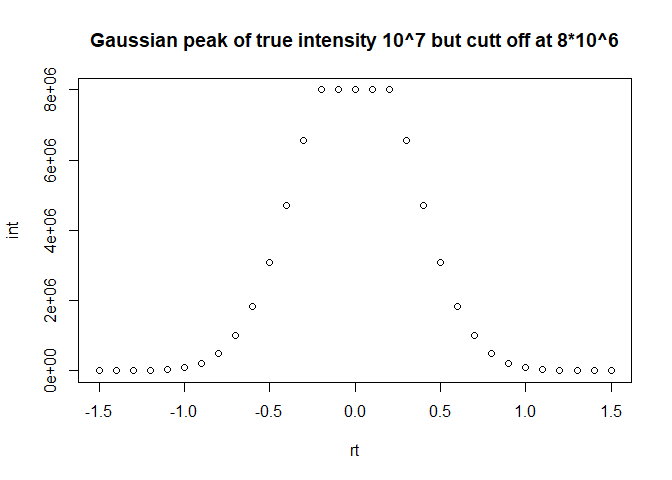
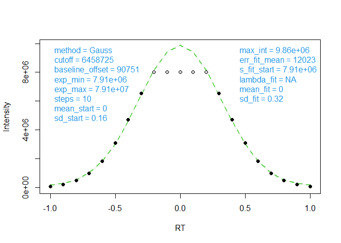
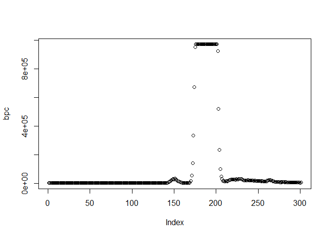
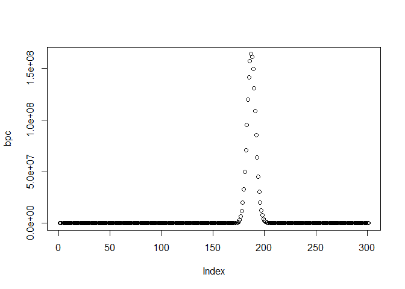

<!-- README.md is generated from README.Rmd. Please edit that file -->

# CorrectOverloadedPeaks

<!-- badges: start -->

[](https://CRAN.R-project.org/package=CorrectOverloadedPeaks)
[](https://doi.org/10.1021/acs.analchem.6b02515)
<!-- badges: end -->

Time series data are often analyzed for peak signals. Mass spectrometry
data may contain flat top peaks due to technical limitations
(i.e. detector saturation, DS). Flat top peaks can also be termed
‘overloaded’ signals. Extracting the peak height to infer signal
intensity will obviously give wrong results for flat top peaks.

However, using the peak shape in the non-distorted fraction of the
signal (intensity below DS), the true peak shape can be modeled
mathematically. This modeling is the core task of
**CorrectOverloadedPeaks**.

The R package accepts data in xcmsRaw and mzXML format as input.
Overloaded signals are detected automatically and modified using an
Gaussian or Isotopic-Ratio approach, QC plots are generated and
corrected data are stored within the original xcmsRaw or mzXML
respectively to allow further processing.

This way **CorrectOverloadedPeaks** can be incorporated in any
metabolomics pipeline. Some utility functions are additionally exported,
i.e. `read.mzData()` and `FitGaussPeak()`.

## Installation

You can install the development version of CorrectOverloadedPeaks from
[GitHub](https://github.com/) with:

``` r
# install.packages("devtools")
devtools::install_github("janlisec/CorrectOverloadedPeaks")
```

or install from
[CRAN](https://cran.r-project.org/package=CorrectOverloadedPeaks)
instead.

## Quick Example

This is a basic example, modeling a flat topped peak first and restoring
the true shape assuming a Gaussian peak shape afterwards.

``` r
# model and a gauss shaped peak with flat top
pk <- CorrectOverloadedPeaks::ModelGaussPeak(height=10^7, width=3, scan_rate=10, e=0, ds=8*10^6, base_line=10^2)
head(pk)
#>     rt        int
#> 1 -1.5   254.1935
#> 2 -1.4   994.0029
#> 3 -1.3  3538.0822
#> 4 -1.2 11463.1824
#> 5 -1.1 33806.4456
#> 6 -1.0 90750.8782
plot(pk, main="Gaussian peak of true intensity 10^7 but cutt off at 8*10^6")
```

<!-- -->

``` r

# identify the peak range and estimate the correct intensities
idx <- pk[,"int"]>0.005 * max(pk[,"int"])
tmp <- CorrectOverloadedPeaks::FitGaussPeak(x=pk[idx,"rt"], y=pk[idx,"int"], silent=FALSE, xlab="RT", ylab="Intensity")
#> Number of converging sollutions: 10, keeping 1
```

<!-- -->

``` r
cbind(pk[idx,], tmp)
#>      rt        int       tmp
#> 6  -1.0   90750.88  171547.9
#> 7  -0.9  221747.73  291699.9
#> 8  -0.8  493201.67  544819.9
#> 9  -0.7  998497.33 1022947.9
#> 10 -0.6 1840035.92 1829520.9
#> 11 -0.5 3086474.61 3037377.9
#> 12 -0.4 4712551.77 4627623.9
#> 13 -0.3 6549476.30 6437285.9
#> 14 -0.2 8000000.00 8156882.9
#> 15 -0.1 8000000.00 9404884.9
#> 16  0.0 8000000.00 9862406.9
#> 17  0.1 8000000.00 9404884.9
#> 18  0.2 8000000.00 8156882.9
#> 19  0.3 6549476.30 6437285.9
#> 20  0.4 4712551.77 4627623.9
#> 21  0.5 3086474.61 3037377.9
#> 22  0.6 1840035.92 1829520.9
#> 23  0.7  998497.33 1022947.9
#> 24  0.8  493201.67  544819.9
#> 25  0.9  221747.73  291699.9
#> 26  1.0   90750.88  171547.9
```

Next, we load some real life measurement data and correct the two
overloaded peaks contained.

``` r
x <- CorrectOverloadedPeaks::mzXML_data

# identify the maximum intensity values per scan
bpc <- sapply(x[[5]], function(y) { max(y$peaks) })
plot(bpc)
```

<!-- -->

``` r

# correct the overloaded data
x_corr <- CorrectOverloadedPeaks::CorrectOverloadedPeaks(data = x, method = "EMG")
bpc <- sapply(x_corr[[5]], function(y) { max(y$peaks) })
plot(bpc)
```

<!-- -->

## Detailed documentation

You might either read the
[Vignette](https://cran.r-project.org/package=CorrectOverloadedPeaks/vignettes/CorrectOverloadedPeaks.html)
describing the package functions in detail or read the
[publication](https://doi.org/10.1021/acs.analchem.6b02515) which shows
a evaluation of the performance of **CorrectOverloadedPeaks** on real
data sets.
